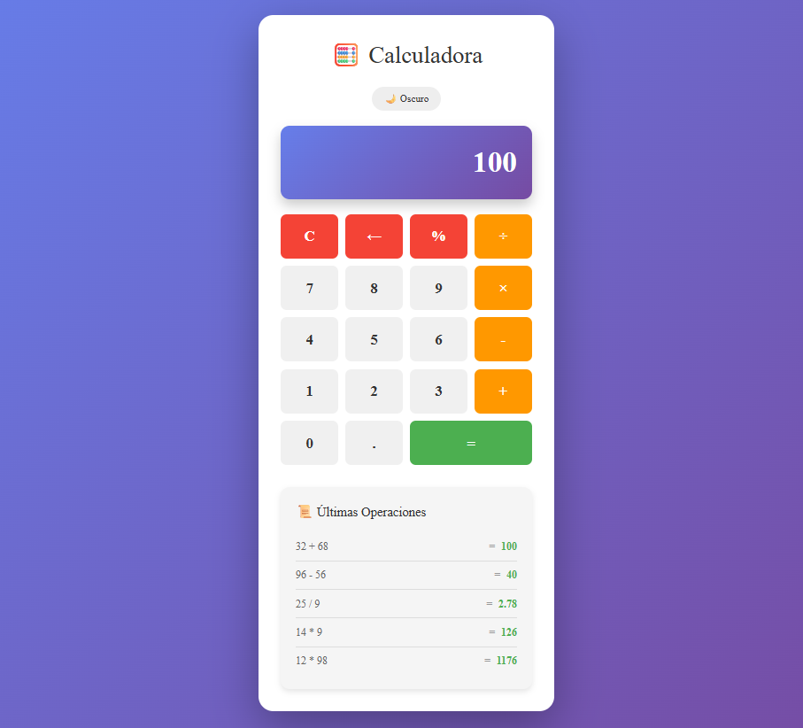

# Calculadora React + TypeScript

Aplicación de calculadora funcional desarrollada con React, TypeScript y TailwindCSS como práctica de Dispositivos Móviles I.



## Tecnologías utilizadas

- React 18
- TypeScript
- TailwindCSS V4
- Vite
- pnpm

## Pasos de Implementación

### Paso 1: Crear el proyecto con Vite

```bash
pnpm create vite@latest calculadora-react -- --template react-ts
cd calculadora-react
pnpm install
```

### Paso 2: Instalar TailwindCSS V4

```bash
pnpm add -D tailwindcss @tailwindcss/postcss
```

Configurar `src/index.css`:

```css
@import "tailwindcss";
```

### Paso 3: Crear la estructura de carpetas

```bash
mkdir -p src/components/Calculator/{Display,ButtonPad,Button,History}
mkdir -p src/types
```

### Paso 4: Crear los tipos TypeScript

Archivo `src/types/calculator.ts` con los tipos `Operator`, `Operation` y `CalculatorState`.

### Paso 5: Crear los componentes en orden

1. `Button.tsx` + `Button.module.css` — Botón individual con variantes: number, operator, equals, special
2. `Display.tsx` + `Display.module.css` — Muestra el valor actual en pantalla
3. `ButtonPad.tsx` + `ButtonPad.module.css` — Panel de botones en grid de 4 columnas
4. `History.tsx` + `History.module.css` — Lista de últimas 5 operaciones
5. `Calculator.tsx` + `Calculator.module.css` — Componente principal con toda la lógica

### Paso 6: Lógica principal en Calculator.tsx

Se aplicaron los siguientes hooks:

- `useState` para gestionar: display, previousValue, currentOperator, isNewNumber, history, operationCount, isDark
- `useEffect` para validar el límite de 12 dígitos cada vez que el display cambia

Funciones implementadas:

- `handleNumber` — Maneja la entrada de números y punto decimal
- `handleOperator` — Guarda el operador y calcula resultados encadenados
- `calculate` — Realiza la operación matemática con validación de división por cero
- `handleEquals` — Calcula el resultado final y agrega al historial
- `handleClear` — Limpia toda la calculadora
- `handleBackspace` — Borra el último dígito del display
- `handlePercentage` — Convierte el número actual a porcentaje

### Paso 7: Actualizar App.tsx

```tsx
import Calculator from './components/Calculator/Calculator';

function App() {
  return (
    <div className="App">
      <Calculator />
    </div>
  );
}
```

### Paso 8: Funcionalidades Extra

**Historial de operaciones**
Se implementó con `useState<Operation[]>` guardando las últimas 5 operaciones con expresión, resultado y timestamp.

**Botón Backspace**
Función `handleBackspace` que borra el último dígito o resetea a `'0'` si queda un solo dígito.

**Botón Porcentaje**
Función `handlePercentage` que divide el valor actual entre 100.

**Tema oscuro/claro**
Estado `isDark` que aplica la clase CSS `.dark` al contenedor principal, cambiando los colores del wrapper y título.

**Sonidos**
Función `playSound` usando la Web Audio API (`AudioContext`) que genera un tono corto de 600hz al presionar cualquier botón.

**Guardado en localStorage**
Se inicializan los estados leyendo desde `localStorage` y se usan `useEffect` para guardar automáticamente: display, historial, contador y tema cada vez que cambian.

### Paso 9: Ejecutar el proyecto

```bash
pnpm dev
```

## Arquitectura de Componentes

src/

├── components/

│   └── Calculator/

│       ├── Calculator.tsx

│       ├── Calculator.module.css

│       ├── Display/

│       ├── ButtonPad/

│       ├── Button/

│       └── History/

├── types/

│   └── calculator.ts

├── App.tsx

└── App.css

